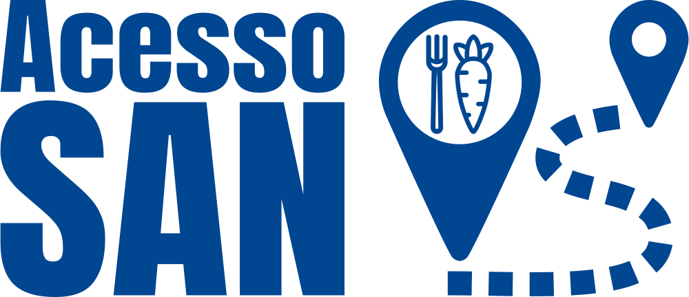

```{r}
#| label: setup
#| include: false

library(here)

here("R", ".setup.R") |> source()
```

<!-- badges: start -->
[](https://www.repostatus.org/#wip)
[](https://doi.org/10.17605/OSF.IO/P5UFJ)
[](https://www.gnu.org/licenses/gpl-3.0)
[](https://creativecommons.org/licenses/by-nc-sa/4.0/)
<!-- badges: end -->

## Visão Geral

O presente estudo visa prover mapas gerados pela [Função de Densidade de Kernel](https://doc.arcgis.com/en/arcgis-online/analyze/kernel-density-global-function.htm) sobre o acesso aos alimentos saudáveis em favelas e comunidades urbanas, por meio do angariamento, processamento, geocodificação e classificação dos dados dos [CNPJ](https://en.wikipedia.org/wiki/CNPJ)s provenientes tanto da Receita Federal Brasileira ([RFB](https://www.gov.br/receitafederal/)) quanto da Relação Anual dos Informes Sociais ([RAIS](https://www.rais.gov.br/)) do Ministério do Trabalho e do Emprego ([MTE](https://www.gov.br/trabalho-e-emprego)), como também os dados sobre os estabelecimentos classificados como de venda de alimentos saudáveis do OpenStreetMap ([OSM](https://www.openstreetmap.org/#map=4/-15.13/-53.19)), via [Overpass API](https://wiki.openstreetmap.org/wiki/Overpass_API). A classificação sobre a saudabilidade alimentar segue o estudo [Locais-Nova](https://doi.org/10.1590/S2237-96222025v34.20240361.en), usando o Grupo 0 (G0), este não sendo parte da classificação original, entretanto é um subgrupo existente no grupo G1 + G2 do qual é composto por estabelecimentos que vendem alimentos exclusivamente saudáveis que deveriam fazer parte da dieta populacional.

Para instruções de como usar o pipeline, veja [README](https://github.com/cem-usp/kernel-accessibility/blob/main/README.md) no repositório. 

## Problema

O projeto [AcessoSAN](https://doi.org/10.17605/OSF.IO/ZE6WT) almeja desenvolver novos métodos de medição e de análise da desilguadade existente no acesso aos alimentos saudáveis, particularmente nas favelas e comunidades urbanas brasileiras. Para alcançar tais objetivos, faz-se necessário o uso de bases de dados confiáveis e atualizadas sobre os estabelecimentos que vendem comida saudável.

Tanto a [RFB](https://www.gov.br/receitafederal/) quanto a [RAIS](https://www.rais.gov.br/) listam companhias que operam no Brasil, incluindo varejos alimentares. Entretano, não fornece [informações geocodificadas](https://en.wikipedia.org/wiki/Address_geocoding), necessárias para a análise espacial. Esse pipeline segue os trabalhos realizados pelos estudos de [Caldeira et al.(2026)](https://github.com/cem-usp/locais-nova-rais-geocoding/tree/main), para a georreferenciar os dados dos [CNPJ](https://en.wikipedia.org/wiki/CNPJ)s da [RAIS](https://www.rais.gov.br/), de [Vartanian et al. (2026)](https://github.com/cem-usp/locais-nova-rfb-geocoding/tree/main), para a georreferenciar os dados dos [CNPJ](https://en.wikipedia.org/wiki/CNPJ)s da [RFB](https://www.gov.br/receitafederal/), e de [Freitas et al. (2026)](https://github.com/cem-usp/locais-nova-access/tree/main), para obter as métricas de acessibilidade do grupo G0. 

Além disso, para entender melhor os gaps informacionais existentes sobre as informações relacionadas ao acesso aos alimentos saudáveis, será realizado, também, análises referentes aos dados disponíveis na [Overpass API](https://wiki.openstreetmap.org/wiki/Overpass_API) como meio de comparação com os resultados obridos da [RFB](https://www.gov.br/receitafederal/) e da [RAIS](https://www.rais.gov.br/).

## Disponibilidade dos Dados


## Métodos

### Fonte dos Dados


### Processamento dos Dados

O processamento dos dados segue o workflow de ciência de dados criado por @wickham2023e como ilustrado in [@fig-wickham-at-al-2023-figure-1]. Todos os processos foram feitos usando o sistema de publicação [Quarto](https://quarto.org/) em conjunto com as linguagens de programação [AWK](https://en.wikipedia.org/wiki/AWK) [@aho2023] e [R](https://www.r-project.org/) [@rcoreteam], apoiadas por diverso pacotes do R.

Para o workflow e o processamento dos dados foi dado priodridade aos pacotes do [tidyverse](https://www.tidyverse.org/), [rOpenSci](https://ropensci.org/) e [r-spatial](https://r-spatial.org/) frameworks, assim como outros pacotes que aderem ao manifesto tidy tools [@wickham2023c].

::: {#fig-wickham-at-al-2023-figure-1}
{width=75%}

[Source: Reproduced from @wickham2023e.]{.legend}

Data science workflow created by Wickham, Çetinkaya-Runde, and Grolemund.
:::

### Estrutura dos Dados


### Estilo do Código

O Tidyverse [manifesto tidy tools](https://tidyverse.tidyverse.org/articles/manifesto.html) [@wickham2023c], [guia do estilo de código](https://style.tidyverse.org/) [@wickhama] e [design principles](https://design.tidyverse.org/) [@wickhamc] foram seguidos para garantir consistência e melhorar a legibilidade.

### Reprodutibilidade

O pipeline é integralmente reprodutível e pode ser reexecutado a qualquer momento. Para assegurar consistência nos resultados, utilizou-se o pacote [renv](https://rstudio.github.io/renv/) package [@ushey2025] para gerenciar e restaurar o ambiente R. Consulte o arquivo [README](https://github.com/cem-usp/kernel-accessibility/blob/main/README.md) no repositório para instruções de execução.

## Preparar o Ambiente

```{r}
#| label: Set Environment
#| include: false


```

### Carregar os Pacotes


```{r}

```

## Reconhecimentos

:::: {.columns style="display: flex; align-items: center; margin: 1em; padding-top: 1em;"}
::: {.column style="width: 30%; text-align: center;"}
[{width="140"}](https://doi.org/10.17605/OSF.IO/ZE6WT)
:::
::: {.column style="width: 70%; display: flex; align-items: center;"}
This work is part of a research project by the Polytechnic School ([Poli](https://www.poli.usp.br/)) of the University of São Paulo ([USP](https://usp.br/)), in partnership with the National Secretariat for Food and Nutrition Security ([SESAN](https://www.gov.br/mds/pt-br/orgaos/SESAN)) of the Brazilian Ministry of Social Development and Assistance, Family and Fight Against Hunger ([MDS](https://www.gov.br/mds/)), titled: *AcessoSAN: Mapping Food Access to Support Public Policies on Food and Nutrition Security and Hunger Reduction in Brazilian Cities*.
:::
::::

:::: {.columns style="display: flex; align-items: center; margin: 1em; padding-top: 0em;"}
::: {.column style="width: 30%; text-align: center;"}
[{width="190"}](https://centrodametropole.fflch.usp.br)
:::
::: {.column style="width: 70%; display: flex; align-items: center;"}
This work was developed with support from the Center for Metropolitan Studies ([CEM](https://centrodametropole.fflch.usp.br)) based at the School of Philosophy, Letters and Human Sciences ([FFLCH](https://www.fflch.usp.br/)) of the University of São Paulo ([USP](https://usp.br/)) and at the Brazilian Center for Analysis and Planning ([CEBRAP](https://cebrap.org.br/)).
:::
::::

:::: {.columns style="display: flex; align-items: center; margin: 1em; padding-top: 0em;"}
::: {.column style="width: 30%; text-align: center;"}
[{width="160"}](https://fapesp.br/)
:::
::: {.column style="width: 70%; display: flex; align-items: center;"}
This study was financed, in part, by the São Paulo Research Foundation ([FAPESP](https://fapesp.br/)), Brazil. Process Number [2025/17879-2](https://bv.fapesp.br/en/bolsas/231507/geospatial-data-science-applied-to-food-policies/).
:::